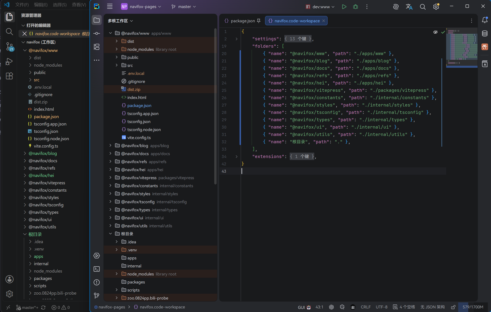

# Multi-Root Workspace View

中文／[English](README.en.md)

一个 JetBrains IDE 插件，可以在“项目”（Project）工具窗口中呈现像 VS Code 那样的工作区视图。



## 亮点

- 同时展示多个文件夹，允许路径相互包含（原生的 **多工作区** 功能不允许这样子）。
- 直接依赖 VS Code 配置文件 `*.code-workspace` 并支持在“设置”中切换用哪个。
- 拥有与 JetBrains IDE 原生目录树一致的体验。
- 支持多种语言文字。

## 兼容

- 兼容版本 2025.3 到 2026.1.* 的 IntelliJ 平台产品，对应内部构建 `253` 至 `261.*`。
- 暂不考虑多工作区，目前只能呈现 **单个** 工作区配置 `.code-workspace` 的文件夹们。

## 开始

1. 挑一个顺手的 JetBrains IDE 打开项目。
2. 点开“项目”工具窗口，在左上角的下拉框中切换到 **多根工作区** 选项。
3. 此时会直接展示项目根目录下 `.code-workspace` 文件在 `folders` 字段配置的文件夹。
4. 如果显示“没有可用配置”，点击提示下方的按钮，在弹出的文件保存窗口中点击确定，即可在项目根目录下创建一个 `.code-workspace` 文件。

## 结构

```
.
├── .run/                   预定义的运行/调试配置
├── gradle/
│   ├── wrapper/            Gradle 包装器
│   ├── libs.versions.toml  版本目录
├── src/                    插件源代码
│   └── main/
│       ├── java/           源代码，Java 编写。本项目不使用 Java 所以目前没有
│       ├── kotlin/         源代码，Kotlin 编写
│       └── resources/      插件资源文件
│           ├── META-INF/   插件配置文件和图标
│           └── messages/   文本资源包
├── .gitignore              Git 忽略规则
├── build.gradle.kts        Gradle 构建配置
├── gradle.properties       Gradle 配置属性
├── gradlew                 *nix 系统下的 Gradle 包装器脚本
├── gradlew.bat             Windows 系统下的 Gradle 包装器脚本
├── README.md               本文件
└── settings.gradle.kts     Gradle 项目设置
```

```
./src/main/kotlin/net/navifox/plugins/
├─ NavifoxMessageBundle.kt               动态消息包封装
├─ core/                                 *.code-workspace 处理工具包（无 UI 依赖）
│  ├─ Jsonc.kt                           JSONC → 严格 JSON 消毒（注释/尾逗号/BOM）
│  ├─ MrWorkspace.kt                     数据模型与异常
│  ├─ MrWorkspaceParser.kt               解析与路径解析纯函数
│  └─ MrWorkspaceSelector.kt             文件发现/选定/顺延加载
└─ workspace/                            特性 UI 层
   ├─ MrWorkspaceViewPane.kt             面板主类（含空态覆盖层）
   ├─ MrWorkspaceSelectInTarget.kt       Alt+F1 定位目标
   ├─ MrWorkspaceConfigCreator.kt        新建配置流程（保存对话框 + 模板）
   ├─ MrWorkspaceSettings.kt             项目级设置
   └─ MrWorkspaceSettingsConfigurable.kt 设置页
```

## 文档

### 插件开发相关参考

- [IntelliJ Platform Plugin SDK](https://plugins.jetbrains.com/docs/intellij)
- [IntelliJ Platform Gradle Plugin](https://plugins.jetbrains.com/docs/intellij/tools-intellij-platform-gradle-plugin.html)

## 链接

- 罗狐会馆，QQ群 [540457640](https://qm.qq.com/q/7WO1tJmTss)。
